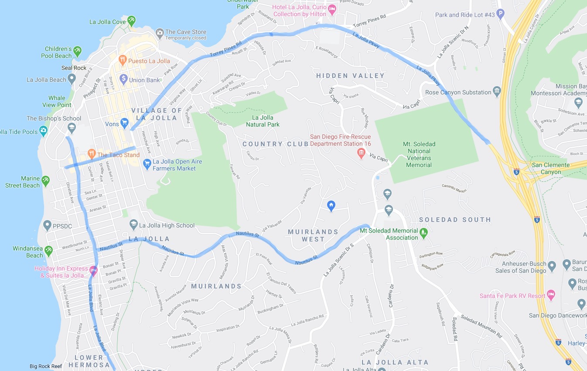
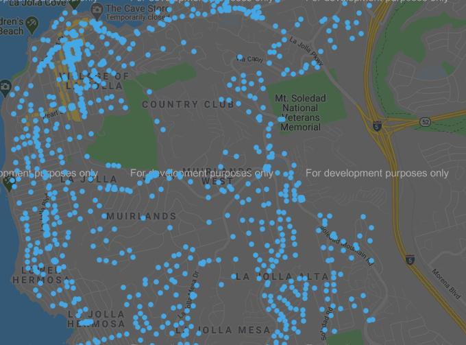
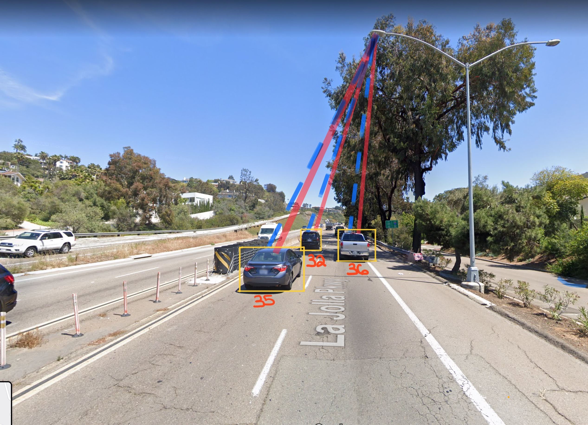
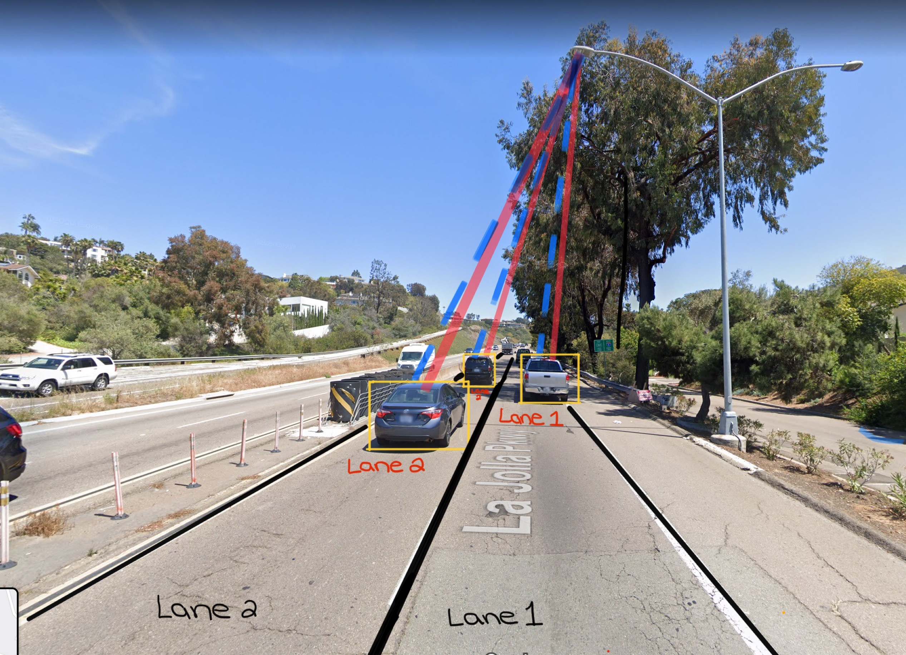
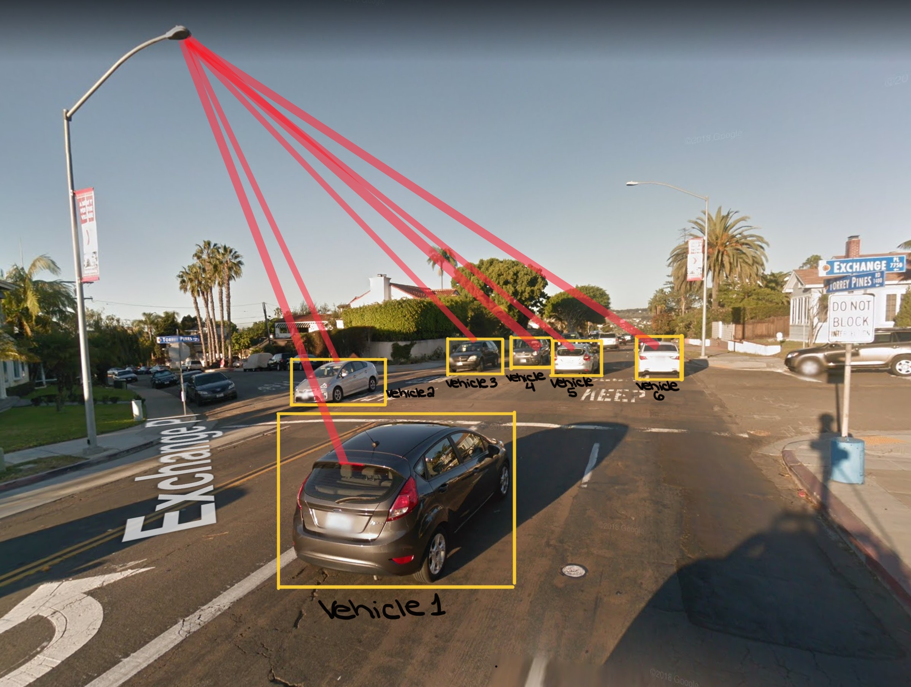
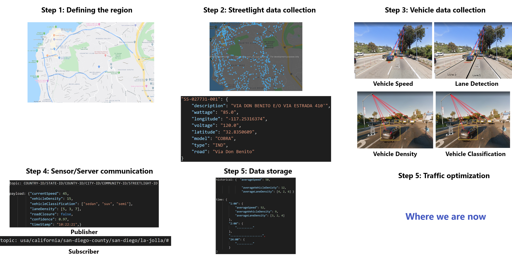
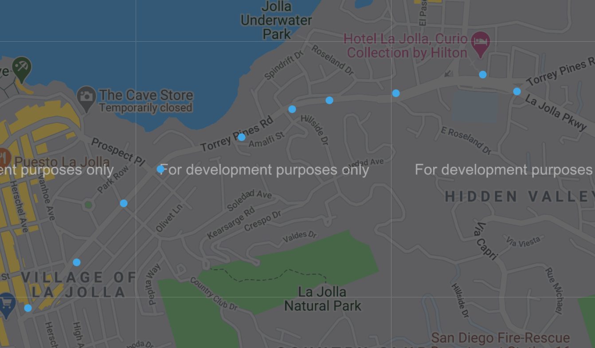

# Final Project Draft: Traffic Control

### Defining The Problem
According to the [National Association of City Transportation Officials](https://nacto.org/publication/urban-street-design-guide/intersection-design-elements/traffic-signals/signal-cycle-lengths/), the perfect amount of time for a light to remain red it between 60 and 90 seconds.  Taking into account that approximately twenty percent of all driving time is spent at red lights, that can certainly add up.  Furthermore, according to [AAA](http://newsroom.aaa.com/2016/09/americans-spend-average-17600-minutes-driving-year/), the average American spends 17,600 minutes driving each year.  Thus, 3,520 minutes, or 58.6 hours, are spent waiting at red lights each year.

Not only is waiting at red lights frustrating, it is also harmful to the environment and to our health.  Being stopped at a red light increases travel time.  This increase in travel time results in an increase in emitted pollution.  Also, while at a red light many drivers are surrounded by idling engines creating pollution hot-spots.  A study conducted in the United Kingdom monitored drivers' exposure to air pollutants at various points of a journey.  It was found that traffic intersections produced pollution hot-spots.  With drivers decelerating and stopping at lights, idling for a period of time, and then revving up to move quickly when lights turn green, peak particle concentration was found to be twenty-nine times higher than that during free-flowing traffic conditions.    

As cities continue to become more dense and the number of cars on the street increases, traffic congestion and traffic light waiting times will only become more problematic.  While many of the traffic lights in our cities are able to adapt to changes in demand (i.e. the number of cars currently at a light) they can only adjust to cars which are already at the light.  Thus, they fail to foresee changes in demand that will occur a short period of time into future.  In order to combat these problems I am building a system that gathers current traffic information and then uses the information to make global traffic flow decisions.  Thus, my final project will focus on building an IoT network for traffic control.

At a high level this project asks two questions.  First, how do we collect the information needed to make global traffic flow decisions?  Second, once the information is gathered how do traffic signals make global traffic flow decisions?  

In order to answer these questions I begin by stating the goals and reviewing the terminology that will be used throughout the report.  The next section focuses on data collection which includes geographic scale, sensor types and quantities, data transport, data rates, and data storage.  After a thorough discussion on data collection the following section will detail how this information could be used to make global traffic flow decisions.  Once this has been done I will discuss the architecture linking the data collection system and decision making system together.  Lastly, I will review an elementary prototype of this system using various live traffic API's, the MQTT message protocol, traffic optimization algorithms, and data visualizations for human monitoring. 

### Goals
- Compile sufficient information about streetlights which will be used as the backbone of the traffic control system 
- Determine the sensors necessary to gather live traffic information
- Define a mode of communication between sensors and server
- Outline a few possible optimization methods for traffic control using live traffic data from sensors and stored historical data

### Terminology
- **Streetlight:** A light on the side of the road used to illuminate the road surface (not a traffic light)
- **Traffic light:** A light at an intersection directing traffic
- **Current:** The immediate time frame and lasts for ten seconds, thus it refers to the current state of traffic within about five-hundred feet
- **Future:** The time frame between ten seconds to two minutes after the current time frame which is between five-hundred feet and one mile
- **Global:** A ___ radius emanating from a traffic control light
- **Optimum traffic flow:** A function of motor vehicle speed, density, and wait time

### Geographic Scale
Traffic control is a broadly scoped project.  To consolidate the implementation of the project I will be focusing on traffic control in La Jolla, California.  The map included below showcases the high-level road structure of La Jolla.  This cross-section covers about three miles horizontally and two miles vertically.  Additionally, special attention will be focused on Torrey Pines Road.  This is because the road handles much of the traffic entering/leaving La Jolla and is known to get congested during rush hour, school drop-off/pickup, and the summer months.



This geographical working space will be filled with sensors to monitor road activity.  The sensors for the traffic control system will be placed at streetlights.  The use of streetlights for sensors is crucial for this system because they provide the necessary electricity needed to run the sensors during the day an night, removing the need for additional power lines to be installed.  

Using a database provided by the City of San Diego I was able to find all of the streetlights in La Jolla. The data was stored via csv with the following format `ID, Model, Type, Wattage, Voltage, Longitude, Latitude, Description`.  To determine if the streetlight was in La Jolla it was necessary to do some prescreening because there were over 60,000 entries.  I first pruned the data by picking a rough boarder around La Jolla.  These coordinates were `max_latitude_north = 32.889147`, `min_latitude_south = 32.802140`, `max_longitude_west = -117.289555`, and `min_longitude_east = -117.235660`.  Then I checked to see if the streetlight was within these coordinates.  If it was outside of the range the entry was ignored because it was outside of La Jolla.  However, if the coordinates were within the rough boundary, closer inspection was needed.  To definitively determine if the streetlight was in La Jolla I made use of a python library to query the coordinates.  The returned result from the query contains a postal code field which I used to determine if the streetlight was in La Jolla.  For each streetlight in La Jolla I added it to a JSON with the key field being the streetlights identification number and values being filled with the rest of the data from the csv. The files pertaining to the streetlight locations can be found in the following directory `final-project/data/streetlight-data/`.  Within this directory the following files are present:

`streetlight-locations.csv`: contains the raw csv data with information for every streetlight in San Diego (provided by City of San Diego website)

`streetlight-dictionary.csv`: contains explanations of each of the abbreviations used in streetlight-locations.csv (provided by City of San Diego website)

`streetlight-parser.py`: script to parse through csv data, returns JSON of all streetlights in La Jolla with appropriate key value pairs

`streetlight-mapping.py`: script to read through JSON and extract coordinates of each streetlight (this information was used for the map below)

`streetlight-json.json`: JSON database of all streetlights in La Jolla.  The key is the unique streetlight identification number and the value is the associated data with the streetlight

```JSON
"SS-027731-001": {
    "description": "VIA DON BENITO E/O VIA ESTRADA 410'",
    "wattage": "85.0",
    "longitude": "-117.25316374",
    "voltage": "120.0",
    "latitude": "32.8350609",
    "model": "COBRA",
    "type": "IND",
    "road": "Via Don Benito"
}
```

`geopy-query-raw-data-example.json`: an example result from querying the geopy library

```JSON
"display_name": "8593, La Jolla Shores Drive, La Jolla Farms, Torrey Pines, San Diego, San Diego County, California, 92037, United States of America", 
"place_id": 5212231, 
"lon": -117.2525, 
"boundingbox": [32.86358, 32.86378, -117.2526, -117.2524], 
"osm_type": "node", 
"licence": "Data \xa9 OpenStreetMap contributors", 
"ODbL 1.0. https": "//osm.org/copyright", 
"osm_id": 596382713, 
"lat": "32.86368", 
"address": {
    "city": "San Diego", 
    "house_number": 8593, 
    "country": "United States of America", 
    "county": "San Diego County", 
    "suburb": "Torrey Pines", 
    "state": "California", 
    "road": "La Jolla Shores Drive", 
    "country_code": "us", 
    "neighbourhood": "La Jolla Farms", 
    "postcode": "92037"
}
```
Using an online [mapping software](http://www.copypastemap.com/) I was able to plot all of the coordinates of the streetlights in La Jolla.



From the data provided by the City of San Diego there are about 1000 streetlights in La Jolla which can be used to mount and power the various sensors.  There are two reasons for using streetlights as docking points instead of placing them in the road.  First, in-road sensors have high installation, maintenance, and repair costs.  Second, streetlight sensors are much easier to fix or update because they do not require road construction. 

The capabilities of the sensors placed on the streetlights must include: speed detection, vehicle density, lane detection, and vehicle classification.  There are many sensors that can be used to accomplish these goals.  Thus, to come to a conclusion on the best sensors to use it is important to review each of the sensors capabilities and its advantages/disadvantages.  The sensors that will be reviewed in this report include: video cameras, radar sensors, infrared sensors, ultrasonic sensors, and acoustic array sensors. 

Video cameras can be placed along the road to collect and analyze video to determine traffic flow and vehicle occupancy.  However, using video cameras requires heavy image processing and sophisticated algorithm-based software for interpreting the images and translating them into traffic data.  This is likely to be resource intensive and impractical for high data rates because images possess large amounts of data.  Additionally, video cameras are highly susceptible to bad weather conditions.   

Radar sensors transmit low-energy microwave radiation that is reflected by all objects within the detection zone.  There are different types of radar sensor systems.  The Doppler systems use the frequency shift of the return signal to track the number of vehicles, and determine speed very accurately.  Another systems uses frequency-modulated continuous wave radar which radiates continuous transmission power and is used to measure flow volume, speed, and presence.  The advantage to using radar sensors is that they are easy to install, support multiple detection zones, and can operate during the day or night.  Their main disadvantage is that they are susceptible to electromagnetic interference.

Infrared sensors detect the energy generated by vehicles, road surfaces, or other objects.  These sensors convert the reflected energy into electrical signals that are sent to the processing unit.  Infrared sensors are divided into two categories, passive infrared and active infrared.  Passive infrared detects vehicles based on emission or reflection of infrared radiation and are used to collect data on flow volume, vehicle presence, and vehicle occupancy.  Active infrared sensors use light emitting diodes or laser diodes to measure the reflection time and collect data on flow volume, speed, vehicle classification, vehicle presence, and traffic density.  

Ultrasonic sensors calculate the distance between two objects based on the elapsed time between a sound waves initial transmission and the sensors receiving of the transmission after being reflected by an object.  These sensors are used to collect data about vehicle flow and vehicle speed.  The main disadvantage to ultrasonic sensor is its high sensitivity to environmental effects.

Acoustic array sensors are formed by a set of microphones that are used to detect an increase in sound energy produced by an approaching vehicle.  These sensors are used to calculate traffic volume, vehicle occupancy, and average speed of vehicles.

Given this information I have chosen to use radar and infrared sensors.  Together these sensor are capable of meeting all of the required capabilities, speed detection, vehicle density, lane detection, and vehicle classification.  The radar sensors will be used for tracking vehicle speed and determining the number of vehicles in each lane.  The appeal of radar sensors is the ability to easily install these sensors along with support for multiple detection zones and the ability operate at day or night.  To fulfill the remaining data collection requirements active infrared sensors will be used because they can measure flow volume and classify vehicles.  Below are diagrams showing the data the streetlight sensors will be collecting.  The first two diagrams show the radar sensors detecting vehicle speed and vehicle lane information.  The remaining two diagrams show the infrared sensors collecting vehicle density and vehicle classification information.

  

 

Using these sensors, data will be recorded every fifteen seconds to provide live traffic flow information.  Now that we have a mechanism for recording data we must find a way to communicate this data to the server making the traffic control decisions.  For this system I will be using wireless communication and the MQTT message protocol.  I will be using wireless communication because its installation cost is less expensive and less intrusive.  Additionally, I will be using MQTT because it features lightweight overhead allowing for efficient information distribution at relatively high data rates (update rates in the seconds) as well as scalability.

The two sensors on the streetlights will collect data and combine their findings into a single message containing a string topic and a JSON message payload.  The topic and message payload are defined in the following way. 

```JSON
Publisher

topic: COUNTRY-ID/STATE-ID/COUNTY-ID/CITY-ID/COMMUNITY-ID/STREETLIGHT-ID

payload: {"currentSpeed": 45,       // The current speed of traffic        

          "vehicleDensity": 15,     // The number of vehicles passing the streetlight

          "vehicleClassification": ["sedan", "suv", "semi"], // A list of vehicle types passing the streetlight

          "laneDensity": [5, 3, 7],  // The number of vehicles in each lane passing the streetlight

          "roadClosure": false,     // true=>road closed, false=>road open

          "confidence": 0.97,       // Confidence based on number of data points

          "timeStamp": "10:22:21",  // The time the data was sent }
```

The MQTT message containing the above data will be sent by the publisher (the streetlight) to the message broker (Flespi) and then the subscriber (the server) will retrieve the messages from the message broker.  Once the data has been retrieved by the server we need to make traffic flow decisions.  However, the data in the message payload itself is not sufficient to make informed decisions.  We will also need to store some historical data on the server to understand current traffic flow conditions.  For example, it is not enough to simply know the current speed of the vehicles on a road.  We must also know how this speed relates to the average speed on the road over time.  Thus, the server will also store the following data, a historical average and a time of day average.  The historical average will keep track of the all time average speed, average vehicle density, and average lane density.  The time of day average will keep track of the same information but for a given time period within a day, for example averages between 5pm and 6pm.  This data will be stored in the JSON format seen below 

```JSON
historical: {  "averageSpeed": 50,                  // The all time average speed
            
                "averageVehicleDenisty": 12,        // The all time average vehicle density

                "averageLaneDensity": [4, 2, 6] }   // The all time average lane denisty 

time: { 
        "1:00": { 
            "averageSpeed": 52,                     // The average speed at 1:00AM
            "averageVehicleDensity": 9,             // The average vehicle denisty at 1:00AM
            "averageLaneDensity": [3, 2, 4]         // The average lane density at 1:00AM
        },

        "2:00": {                                   // Data for 2:00AM
            ".........."
        },

        "....................",                     // Data for 3:00AM-23:00PM

        "24:00": {                                  // Data for 24:00AM
            ".........."
        }
}
```
 
I will now quickly summarize what has been discussed so far and then lead into the next portion of the traffic control system, making global traffic flow decisions.  I began by defining the geographical region that this report focuses on, La Jolla, and included a map of the region.  Next, I walked through how I collected streetlight data from the City of San Diego website and how the data was narrowed down to streetlights in La Jolla.  Once I had this information I wrote all of the streetlight data to a JSON and provided a map depicting all streetlights in La Jolla.  Then, I explained what data needed to be collected - vehicle speed, vehicle density, vehicle lane density, and vehicle classification - and the sensors that would be used to collect this data, radar and infrared sensors.  Lastly, I explained how the data would be transferred to the server using a wireless connection and the MQTT message protocol.  Below is a graphic representation of state of the system up to this point. 



Traffic optimization is incredibly difficult and has not been solved up to this point.  Realizing the limitations of my own knowledge and the timeframe allotted for this project I decided to spend most of my project focusing on the skeleton of the IoT system and gathering the necessary information in order to make these decisions, rather than actually coming up with an optimization function.  However, I do believe a few words should be said about making optimal traffic flow decisions and what optimal means in the realm of traffic control.  

When drafting this project I came upon one of the current problems with "smart" traffic systems in place today.  Many of the current systems focus on data at traffic signals.  This is a step in the right direction; however, it is very limited.  These sensors are only able to gather local information (information at a singular intersection) and therefore make decision based on information at the current moment.  What these systems lack is the ability to dynamically adjust to future traffic flow which is beyond the scope of the sensors at the intersection.  This is why the network I have detailed thus far takes advantage of streetlights which cover a much higher percentage of our roads.  The streetlights enable the system to track traffic as it flows through the street and can therefore be used to make predictions about intersection demand in the future.

In order to understand how this system could theoretically support traffic flow optimization decisions it is important to note the information the system has at its disposal, why each piece of information is important, and the optimization criteria.  

As stated earlier the sensors at the streetlights collect data on vehicle speed, vehicle density, lane density, and vehicle classification.  Additionally, historical data is recorded on all of these fields except for vehicle classification.  

The speed of vehicles is important because it gives a measure of current traffic flow as well as an estimation of how long it will take for a vehicle to travel to a particular traffic signal.  

The number of vehicles is also important because the current flow of traffic is not solely explainable by speed.  For example, at a given time there may only be five cars traveling on a road at thirty miles per hour, but at some later point there maybe one-hundred cars on that road traveling at thirty miles per hour.  If we treated these situations that same intersections will become clogged because while traffic is moving fast it will take longer for the vehicles to pass through the intersection.  Thus, more time needs to be allotted for the vehicles to pass through the intersection.  

Additionally, knowing the number of vehicles in each lane can be used to determine how many vehicles are traveling in a certain direction (are most people turning or going straight?).  This will help make decisions about how long to keep lights on for different lanes and how vehicle density will change as vehicles enter/exit a road.  

Lastly, vehicle classification is crucial for optimizing turn lanes and stopped traffic at intersections.  Detecting the type of vehicle is crucial because large vehicles, like semi-truck, take a long time to turn and speed up.  Therefore, if there is a large vehicle in a turn lane or a large vehicle which needs to speed up from a resting state extra time may need to be allotted to allow for a sufficient number of vehicles to cross the intersection.    

With these factors in mind we can now state the optimization criteria.  The system will be considered optimal when the global average speed is maximized.  When the average global speed is maximized it must be true that vehicles are able to make ample progress towards their destination and vehicle stoppage is limited.  In order to meets this criteria it may be helpful to use max-flow 

A max-flow algorithm will be helpful because we don't want to not allow too many vehicles to cross and intersection in one cycle.  If too many vehicles are allowed to cross the intersection the road may become clogged and traffic signals up ahead will become overwhelmed.  Thus, it is beneficial if the optimization algorithm has a sense of each roads carrying capacity and to only allow as many vehicles on that road as can be reasonably supported. 

###### add some more here about optimization

For the last part of this project I worked on an elementary prototype focusing on data collection and visualization.  The prototype utilizes the streetlight data that was presented earlier in the report as well as a traffic API, the MQTT message protocol, and Node-red.

I choose a small subset of streetlights along Torrey Pines Road from the `streetlight-json.json` file (shown below).  The streetlight identification numbers were then hard coded into the python file that can be found in `mqtt-pub-sub/mqtt_pub.py `.  Using these predetermined identification numbers I queried the `streetlight-json.json` file to obtain the coordinate information.  Once I had extracted the coordinates I made a call to an API provided by `https://developer.tomtom.com`.  This API returns live traffic information given a set of coordinates.  This data was used to simulate the data that the streetlight sensors would be recording.  



With this information I constructed a dictionary with the following information: current speed, free flow speed, road status (closed/open), and a timestamp.  Then I published this message payload with the topic conventions specified earlier `united-states/california/san-diego-county/san-diego/la-jolla/STREETLIGHT-ID`

```Python
message_payload = {
    "currentSpeed": API-RESULT['currentSpeed'],                 # The current speed of traffic
    "freeFlowTravelTime": API-RESULT['freeFlowTravelTime'],     # The average speed of traffic
    "roadClosure": API-RESULT['roadClosure'],                   # Status of road
    "timeStamp": time_stamp                                     # Time the data was collected and sent
}
```

To test if the data was being published correctly I used the MQTT subscriber that we wrote at the beginning of the semester.  The results of the test are shown below.

```Console
Publisher successfully sent first message for each of the ten streetlights in the simulation

> python mqtt_pub.py ..\keys.json ..\data\streetlight-data\streetlight-json.json
rc: 0
mid: 1
mid: 2
mid: 3
mid: 4
mid: 5
mid: 6
mid: 7
mid: 8
mid: 9
mid: 10
```

```Console
Subscriber successfuly recieved first message for each of the ten streetlights in the simulation

> python mqtt_sub.py ..\keys.json
rc: 0
Subscribed: 1 (1,)
united-states/california/san-diego-county/san-diego/la-jolla/SX-003870-001 1 {"timeStamp": "12:31:09", "freeFlowSpeed": 25, "currentSpeed": 17, "roadClosure": false}

united-states/california/san-diego-county/san-diego/la-jolla/SX-004007-001 1 {"timeStamp": "12:31:09", "freeFlowSpeed": 26, "currentSpeed": 17, "roadClosure": false}

united-states/california/san-diego-county/san-diego/la-jolla/SX-004119-001 1 {"timeStamp": "12:31:09", "freeFlowSpeed": 13, "currentSpeed": 13, "roadClosure": false}

united-states/california/san-diego-county/san-diego/la-jolla/SS-026689-002 1 {"timeStamp": "12:31:09", "freeFlowSpeed": 35, "currentSpeed": 35, "roadClosure": false}

united-states/california/san-diego-county/san-diego/la-jolla/SX-003972-004 1 {"timeStamp": "12:31:09", "freeFlowSpeed": 37, "currentSpeed": 37, "roadClosure": false}

united-states/california/san-diego-county/san-diego/la-jolla/SX-003891-002 1 {"timeStamp": "12:31:09", "freeFlowSpeed": 25, "currentSpeed": 17, "roadClosure": false}

united-states/california/san-diego-county/san-diego/la-jolla/SX-003875-001 1 {"timeStamp": "12:31:09", "freeFlowSpeed": 35, "currentSpeed": 35, "roadClosure": false}

united-states/california/san-diego-county/san-diego/la-jolla/SX-004075-006 1 {"timeStamp": "12:31:09", "freeFlowSpeed": 25, "currentSpeed": 19, "roadClosure": false}

united-states/california/san-diego-county/san-diego/la-jolla/SX-003934-001 1 {"timeStamp": "12:31:09", "freeFlowSpeed": 37, "currentSpeed": 37, "roadClosure": false}

united-states/california/san-diego-county/san-diego/la-jolla/SX-003880-001 1 {"timeStamp": "12:31:09", "freeFlowSpeed": 25, "currentSpeed": 17, "roadClosure": false}
```

Now that I had determined that the data collection and publication was working correctly I incorporated node-red.  I created a MQTT subscriber node that listened for all messages with the following topic `united-states/california/san-diego-county/#`.  This subscriber was to be used for all of San Diego County.  


https://www.ncbi.nlm.nih.gov/pmc/articles/PMC5948625/


